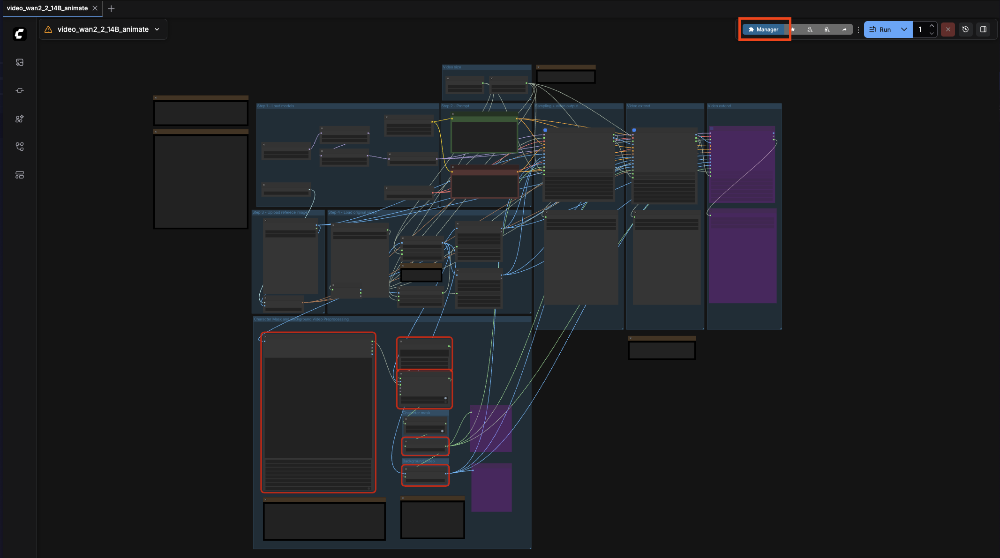
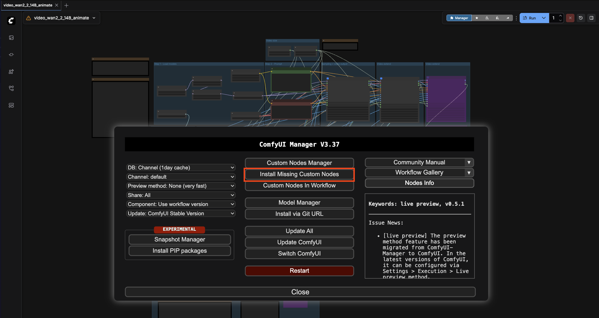
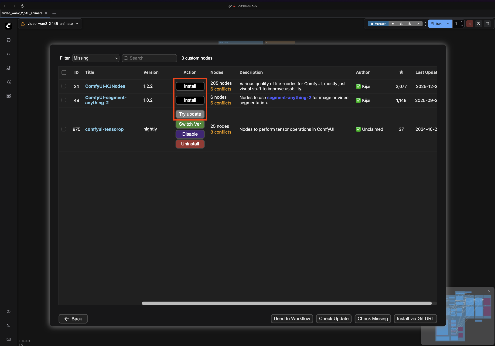

# How to install Templates

In ComfyUI there are multiple templates, each template depends upon:

A. Custom Nodes
B. Multiple Models

## For A. (Installing Custom Nodes)

You must:

1. Launch Manager

2. Install missing nodes and update existing ones

3. For A., you must Restart ComfyUI 

4. Tip: For Reloading Models (B.) Press 'R' inside ComfyUI to reload models—no restart required

## For B. (Installing Multiple Models in one shot)

Go to [Template Installs](../template_installs)

Note: Every script has a standard format. 
Pick up line 
